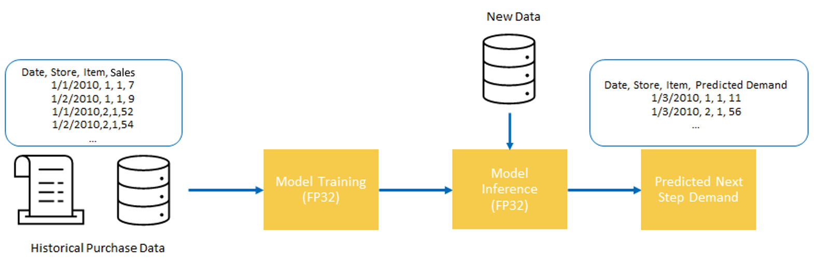
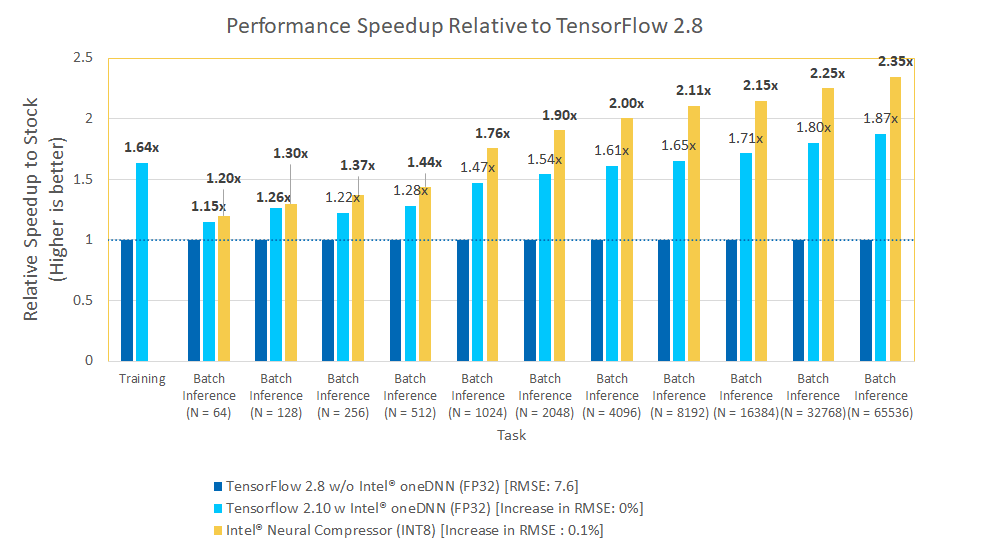

# **Demand Forecasting for Retail using Tensorflow**
## **Table of Contents**
 - [Purpose](#purpose)
 - [Reference Solution](#reference-solution)
 - [Reference Implementation](#reference-implementation)
 - [Intel® Optimized Implementation](#optimized-e2e-architecture-with-intel%C2%AE-oneapi-components)
 - [Performance Observations](#performance-observations)
 - [Experimental Setup](#experiment-setup)


## Purpose

The ability to forecast the demand and thus overcome the problems arising from its variability is one of the top challenges for Supply Chain Managers. When planning the production or the supply of shops, organizations are always managing a short blanket: producing/supplying more to avoid out of stocks implies spending more for production, transportation, and immobilized capital.

In this reference kit, we demonstrate one way in which we can use AI to construct a complex time series model for demand forecasting capable of spanning multiple products and stores all at once.

## Reference Solution

To model the complex patterns that may be present when understanding product demand, it is often necessary to capture complicated mechanisms such as extended seasonality and long-term correlations, resulting in significant feature engineering to come to a good solution.  Modern AI solutions, such as Deep Neural Networks can drastically aid in this process by becoming automatic feature extractors where the explicit mechanisms do not need to be written down, but rather the AI is allowed to learn them from historical data.  

In this reference kit, we follow this Deep Learning approach and demonstrate how to train and utilize a CNN-LSTM time series model, which takes in the last 130 days worth of sales data for a specific item at a specific store, to predict the demand 1 day ahead.  A trained model can then be used to predict the next days demand for every item and every store in a given catalog using only previous purchase data, on a daily basis. 

Broadly, we will tackle this problem using the following pipeline

> Historical Purchase Data => CNN-LSTM Training => CNN-LSTM Inference

## Key Implementation Details

The reference kit implementation is a reference solution to the described use case that includes:

  1. A reference E2E architecture to arrive at an AI solution with a CNN-LSTM model implemented in Tensorflow 
  2. An Optimized reference E2E architecture enabled with Intel® optimizations for Tensorflow and Intel® Neural Compressor for Model Quantization

## Reference Implementation

### E2E Architecture*



### Expected Input-Output

**Input**                                 | **Output** |
| :---: | :---: |
| Past Purchases         | Predicted Demand at the selected horizon |

**Example Input**                                 | **Example Output** |
| :---: | :---: |
| ***Date***, **Store**, **Item**, ***Sales*** <br> 1-1-2010, 1, 1, 5 <br> 1-2-2010, 1, 1, 7 <br> 1-3-2010, 1, 1, 9 <br> 1-4-2010, 1, 1, 11 <br> 1-1-2010, 2, 1, 10 <br> 1-2-2010, 2, 1, 15 <br> 1-3-2010, 2, 1, 20 <br> 1-4-2010, 2, 1, 25 |***Date***, ***Store***, ***Item***, ***Predicted Demand*** <br> 1-5-2010, 13 <br> 1-5-2010, 30

### Dataset

The dataset used for this demo is a synthetic set of daily purchase counts over a period of 5 years characterized by `date`,`item`,`store`,`sales`, where each feature corresponds to:

- `date` : date of purchase
- `item` : item id
- `store` : store id
- `sales` : amount of `item` purchased at `store`

There is exactly 1 row per (`date`, `item`, `store`) tuple.

Treated as a time series, this provides a time view of how purchases change over time for each item at each store.

**To setup this dataset for benchmarking, follow the instructions listed in the data directory [here](data/README.md).**

### Model Training

Using the synthetic daily dataset described below, we train a Deep Learning model to forecast the next days demand using the previous $n$ days.  More specifically, to build a forecasting model for $\text{count}[t]$, representing the sales of a given (`item`, `store`) at time $t$, we first transform the time series data to rows of the form:

(`item`, `store`, `count[t-n]`, `count[t - (n + 1)]`, ..., `count[t-1]`, `count[t]`)

Using data of this form, the forecasting problem becomes a regression problem that takes in the demand/sales of the previous $n$ time points and predicts the demand at the current time $t$, representing the forecasting assumption as:

$f(\text{count}[t-n], \text{count}[t - (n + 1)], ..., \text{count}[t-1]) = \text{count}[t]$.

Here, $n$ and the forecast horizon are configurable if desired beyond $n$ lags and 1-step ahead.  A CNN-LSTM model is used for this application, as opposed to just a LSTM, to allow for the model to better long term dependencies by folding the time series and applying a CNN encoder before modeling the modified sequential dependencies via the LSTM.

### Model Inference

The saved model from the training process can be used to predict demand on new data of the same format.  This expects the previous 130 days sales counts. A multi-step ahead forecast can be generated by iterating this process, using predicted values as input and propagating forward though the model.

### Software Requirements

1. Python 3.8+
2. Tensorflow v2.8.x

To run this reference kit, first clone this repository, which can be done using

```shell
git clone https://www.github.com/oneapi-src/demand-forecasting
```

Note that this reference kit implementation already provides the necessary scripts to setup the software requirements. To utilize these environment scripts, first install Anaconda/Miniconda by following the instructions at the following link

https://docs.conda.io/projects/conda/en/latest/user-guide/install/index.html


### Reference Solution Setup

The `setupenv.sh` can be used to automate the creation of a conda environment for execution of the algorithms using the statements below.

```shell
bash setupenv.sh
1. stock
2. intel
? 1
```

This script utilizes the dependencies found in the `env/stock/stock.yml` file to create an environment as follows:

**YAML file**                                 | **Environment Name** |  **Configuration** |
| :---: | :---: | :---: |
| `env/stock/stock.yml`             | `demand_stock` | Python=3.8.x with Tensorflow v2.8.3 |

For the workload implementation to arrive at first level reference solution we will be using the stock environment

### Reference Implementation

## Optimizing the E2E Reference Solution with Intel® oneAPI

On a production scale implementation with millions or billions of records it is necessary to optimize compute power without leaving any performance on the table.  To utilize all the hardware resources efficiently, software optimizations cannot be ignored.   
 
This reference kit solution extends to demonstrate the advantages of using the Intel® oneAPI Optimizations for Tensorflow on the task of demand forecasting.  The savings gained from using Intel® technologies can lead an analyst to more efficiently explore and understand demand and forecast further into the future without a loss in accuracy.

### Optimized E2E Architecture with Intel® oneAPI Components


### Optimized Software Components

#### *Intel® oneAPI Optimizations for Tensorflow*

Intel® is collaborating with Google* to optimize its performance on platforms based on the Intel® Xeon® processor. The platforms use the Intel® oneAPI Deep Neural Network Library (oneDNN), an open-source, cross-platform performance library for deep-learning applications. These optimizations are directly upstreamed and made available in the official TensorFlow (as of v2.9), which enables developers to seamlessly benefit from the Intel® optimizations.

The latest version of Intel® Optimization for TensorFlow* is included as part of the Intel® oneAPI AI Analytics Toolkit (AI Kit). This kit provides a comprehensive and interoperable set of AI software libraries to accelerate end-to-end data science and machine-learning workflows. 

#### *Intel® Neural Compressor*

Intel® Neural Compressor is an open-source Python* library designed to help you quickly deploy low-precision inference solutions on popular deep-learning frameworks such as TensorFlow*, PyTorch*, MXNet*, and ONNX* (Open Neural Network Exchange) runtime. The tool automatically optimizes low-precision recipes for deep-learning models to achieve optimal product objectives, such as inference performance and memory usage, with expected accuracy criteria.

### Optimized Reference Solution Setup

The `setupenv.sh` can be used to automate the creation of an Intel® oneAPI optimized conda environment for execution of the algorithms using the statements below.

```shell
bash setupenv.sh
1. stock
2. intel
? 2
```
This script utilizes the dependencies found in the `env/intel/intel.yml` file to create an environment as follows:

**YAML file**                                 | **Environment Name** |  **Configuration** |
| :---: | :---: | :---: |
`env/intel/intel.yml`             | `demand_intel` | Python=3.8.x with TensorFlow v2.10, Intel® Neural Compressor |

### Optimized Reference Solution Implementation

Intel® Optimizations for Tensorflow include Intel oneDNN.  **By default, Intel oneDNN optimizations are enabled as of Tensorflow v2.9.**

## **Jupyter Notebook Demo**
You can directly access the Jupyter notebook shared in this repo [here](GettingStarted.ipynb).

To launch your own instance, activate either one of the `stock` or `intel` environments created in this readme and execute the following command.
```sh
jupyter notebook
```

Open `GettingStarted.ipynb` and follow the instructions there to perform training and inference on both the Stock and Intel optimized solutions.

## Performance Observations

In the following, we perform results comparing the Intel® technologies vs the stock alternative on the following 3 primary set of experiments:

### ***1. Benchmarking Training with Intel® oneAPI Optimizations for Tensorflow***

Training is conducted using Intel® oneAPI Optimizations for Tensorflow to accelerate performance using oneDNN optimizations.  Benchmarks are run on batch size of 512 for 10 epochs to explore a range of different possibilities.

### ***2. Batch Inference with Intel® oneAPI Optimizations for Tensorflow/Intel® Neural Compressor***

When it is necessary to forecast demand across a large catalog of items and stores, it is often desirable to predict in large batches to process the workload as quickly as possible. For more complex models, it may also be desirable to reduce the size of the model with minimal accuracy impact to scale the solutions. In this repo, we measure batch inference performance on batch size ranging from 64 to 65536 using both Intel® oneAPI Optimizations for Tensorflow and a Tensorflow model quantized using Intel® Neural Compressor.

### Results Summary

Performance across the models trained using both Tensorflow and the Intel® oneAPI extension for Intel® oneAPI Optimizations for Tensorflow to achieve the same RMSE of ~7.6.



### Key Take Aways and Conclusion

1. Intel® Optimizations for Tensorflow offers upto a 1.64x performance improvement on Model Training and upto a 2.35x performance improvement on Model Inference for batch (n = 65536) workloads over Stock Tensorflow without Intel® oneDNN with an increase of RMSE of only -0.1%.

Demand Forecasting is a pivotal and ever-present component of many business decisions. The ability for an analyst to quickly train a complex model and forecast into the future, whether to analyze a hypothesis or to make key decisions can heavily impact the day the time to market of products.  This reference kit implementation provides a performance-optimized guide around demand forecasting using Deep Learning related use cases that be easily scaled across similar use cases.

## Notices & Disclaimers
Performance varies by use, configuration and other factors. Learn more on the [Performance Index site](https://edc.intel.com/content/www/us/en/products/performance/benchmarks/overview/).<br>
Performance results are based on testing as of dates shown in configurations and may not reflect all publicly available updates.  See backup for configuration details.  No product or component can be absolutely secure. <br>
Your costs and results may vary. <br>
Intel technologies may require enabled hardware, software or service activation.<br>
© Intel Corporation.  Intel, the Intel logo, and other Intel marks are trademarks of Intel Corporation or its subsidiaries.  Other names and brands may be claimed as the property of others.  <br>

## Appendix

### **Experiment setup**
- Testing performed on: October 2022
- Testing performed by: Intel Corporation
- Configuration Details: Azure D4v5 (Intel® Xeon® Platinum 8370C CPU @ 2.80GHz), 1 Socket, 2 Cores per Socket, 2 Threads per Core, Turbo:On, Total Memory: 16 GB, OS: Ubuntu 20.04, Kernel: Linux 5.13.0-1031-azure , Software: Tensorflow 2.10, Tensorflow 2.8, Intel® Neural Compressor 1.13


| **Optimized for**:                | **Description**
| :---                              | :---
| Platform                          | Azure Standard D4v5 : Intel Xeon Platinum 8370C (Ice Lake) @ 2.80GHz, 4 vCPU, 16GB memory
| OS                                | Ubuntu 20.04
| Hardware                          | CPU
| Software                          | Intel® oneAPI Optimizations for Tensorflow v2.10.0, Intel® Neural Compressor v1.13
| What you will learn               | Intel® oneAPI performance advantage over the stock versions

### Known Issues

1. Environment Creation Issue : Could not build wheels for pycocotools

    **Issue:**
      When creating an intel environment using `setupenv.sh` 
      ```
      ERROR: Could not build wheels for pycocotools, which is required to install pyproject.toml-based projects
      ```

    **Solution:**

    Install gcc.  For Ubuntu, this will be: 

      ```bash
      apt install gcc
      ```

2. ImportError: libGL.so.1: cannot open shared object file: No such file or directory
   
    **Issue:**
      When quantizing a model using `run_quantize_inc.py`,
      ```
      ImportError: libGL.so.1: cannot open shared object file: No such file or directory
      ```

    **Solution:**

      Install the libgl1-mesa-glx library.  For Ubuntu, this will be: 

      ```bash
      apt install libgl1-mesa-glx
      ```

3. ImportError: libgthread-2.0.so.0: cannot open shared object file: No such file or directory

    **Issue:**
      When quantizing a model using `run_quantize_inc.py`,
      ```
      ImportError: libgthread-2.0.so.0: cannot open shared object file: No such file or directory
      ```

    **Solution:**
    
      Install the libglib library.  For Ubuntu, this will be: 

      ```bash
      apt install libglib2.0-0
      ```

