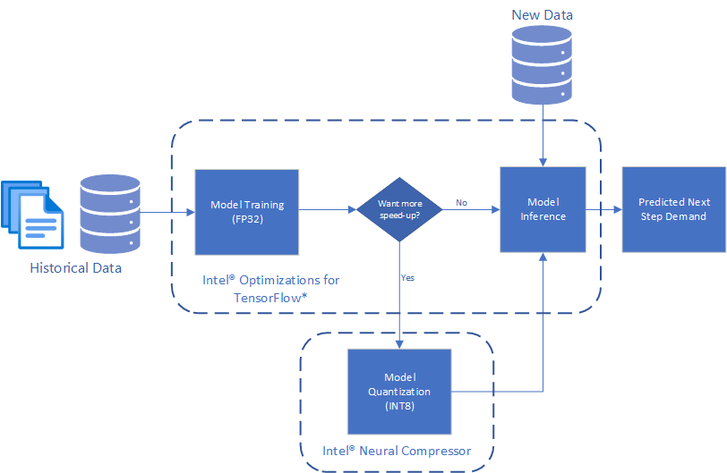

# Demand Forecasting

## Introduction
This reference kit implements an end-to-end (E2E) workflow that, with the help of [Intel® Optimization for TensorFlow*](https://www.intel.com/content/www/us/en/developer/tools/oneapi/optimization-for-tensorflow.html) and [Intel® Neural Compressor](https://www.intel.com/content/www/us/en/developer/tools/oneapi/neural-compressor.html), produces a complex time series model for demand forecasting capable of spanning multiple products and stores all at once.

Check out more workflow examples in the [Developer Catalog](https://developer.intel.com/aireferenceimplementations).

## Solution Technical Overview
The ability to forecast the demand and thus overcome the problems arising from its variability is one of the top challenges for Supply Chain Managers. When planning the production or the supply of shops, organizations are always managing a short blanket: producing/supplying more to avoid out of stocks implies spending more for production, transportation, and immobilized capital.

To model the complex patterns that may be present when understanding product demand, it is often necessary to capture complicated mechanisms such as extended seasonality and long-term correlations, resulting in significant feature engineering to come to a good solution. Modern artificial Intelligence (AI) solutions, such as Deep Neural Networks can drastically aid in this process by becoming automatic feature extractors where the explicit mechanisms do not need to be written down, but rather the AI is allowed to learn them from historical data.  

In this use case, we follow this Deep Learning approach and demonstrate how to train and utilize a Convolutional Neural Network and Long Short-Term Memory Network (CNN-LSTM) time series model, which takes in the last 130 days worth of sales data for a specific item at a specific store, to predict the demand one day ahead. A trained model can then be used to predict the next days demand for every item and every store in a given catalog using only previous purchase data, on a daily basis. 

Broadly, we will tackle this problem using the following pipeline:

> Historical Purchase Data => CNN-LSTM Training => CNN-LSTM Inference

The solution contained in this repo uses the following Intel® packages:

* ***Intel® Optimizations for TensorFlow****

  The latest version of [Intel® Optimization for TensorFlow*](https://www.intel.com/content/www/us/en/developer/tools/oneapi/optimization-for-tensorflow.html) is included as part of the Intel® oneAPI AI Analytics Toolkit (AI Kit). This kit provides a comprehensive and interoperable set of AI software libraries to accelerate end-to-end data science and machine-learning workflows.

* ***Intel® Neural Compressor****

  [Intel® Neural Compressor](https://www.intel.com/content/www/us/en/developer/tools/oneapi/neural-compressor.html) performs model compression to reduce the model size and increase the speed of deep learning inference for deployment on CPUs or GPUs. This open-source Python* library automates popular model compression technologies, such as quantization, pruning, and knowledge distillation across multiple deep learning frameworks.

  Using this library, you can:

  * Converge quickly on quantized models though automatic accuracy-driven tuning strategies.
  * Prune the least important parameters for large models.
  * Distill knowledge from a larger model to improve the accuracy of a smaller model for deployment.
  * Get started with model compression with one-click analysis and code insertion.

For more details, visit [Intel® Optimization for TensorFlow*](https://www.intel.com/content/www/us/en/developer/tools/oneapi/optimization-for-tensorflow.html), [Intel® Neural Compressor](https://www.intel.com/content/www/us/en/developer/tools/oneapi/neural-compressor.html), the [Demand Forecasting](https://github.com/oneapi-src/demand-forecasting) GitHub repository.

## Solution Technical Details
The reference kit implementation is a reference solution to the described use case that includes:

  1. An Optimized E2E architecture to arrive at an AI solution with a CNN-LSTM model implemented in TensorFlow*.
  2. The Intel® optimizations enabled for TensorFlow* and Intel® Neural Compressor for Model Quantization.

### Optimized E2E Architecture with Intel® oneAPI Components



### Dataset

The dataset used for this demo is a synthetic set of daily purchase counts over a period of five years characterized by `date`, `item`, `store`, `sales`, where each feature corresponds to:

- `date`: date of purchase
- `item`: item id
- `store`: store id
- `sales`: amount of `item` purchased at `store`

There is exactly one row per (`date`, `item`, `store`) tuple.

Treated as a time series, this provides a time view of how purchases change over time for each item at each store.

### Expected Data Input-Output

**Input**                                 | **Output** |
| :---: | :---: |
| Past Purchases         | Predicted Demand at the selected horizon |

**Example Input**                                 | **Example Output** |
| :---: | :---: |
| ***Date***, **Store**, **Item**, ***Sales*** <br> 1-1-2010, 1, 1, 5 <br> 1-2-2010, 1, 1, 7 <br> 1-3-2010, 1, 1, 9 <br> 1-4-2010, 1, 1, 11 <br> 1-1-2010, 2, 1, 10 <br> 1-2-2010, 2, 1, 15 <br> 1-3-2010, 2, 1, 20 <br> 1-4-2010, 2, 1, 25 |***Date***, ***Store***, ***Item***, ***Predicted Demand*** <br> 1-5-2010, 2, 1, 20 <br> 1-5-2010, 2,1, 30

## Validated Hardware Details
There are workflow-specific hardware and software setup requirements to run this use case.

| Recommended Hardware                                            | Precision
| ----------------------------------------------------------------|-
| CPU: Intel® 2nd Gen Xeon® Platinum 8280 CPU @ 2.70GHz or higher | FP32, INT8
| RAM: 187 GB                                                     |
| Recommended Free Disk Space: 20 GB or more                      |

Operating System: Ubuntu* 22.04 LTS.

## How it Works

### Model Training

Using the synthetic daily dataset described [here](#dataset), we train a Deep Learning model to forecast the next days demand using the previous $n$ days. More specifically, to build a forecasting model for $\text{count}[t]$, representing the sales of a given (`item`, `store`) at time $t$, we first transform the time series data to rows of the form:

(`item`, `store`, `count[t-n]`, `count[t - (n - 1)]`, ..., `count[t-1]`, `count[t]`)

Using data of this form, the forecasting problem becomes a regression problem that takes in the demand/sales of the previous $n$ time points and predicts the demand at the current time $t$, representing the forecasting assumption as:

$f(\text{count}[t-n], \text{count}[t - (n - 1)], ..., \text{count}[t-1]) = \text{count}[t]$.

Here, $n$ and the forecast horizon are configurable if desired beyond $n$ lags and 1-step ahead. A CNN-LSTM model is used for this application, as opposed to just a LSTM, to allow for the model to learn better long-term dependencies by folding the time series and applying a Convolutional Neural Network (CNN) encoder before modeling the modified sequential dependencies via the Long Short-Term Memory Network (LSTM).

### Model Inference

The saved model from the training process can be used to predict demand on new data of the same format. This expects the previous 130 days sales counts. A multi-step ahead forecast can be generated by iterating this process, using predicted values as input and propagating forward though the model.

## Get Started
Start by **defining an environment variable** that will store the workspace path, this can be an existing directory or one to be created in further steps. This ENVVAR will be used for all the commands executed using absolute paths.

[//]: # (capture: baremetal)
```bash
export WORKSPACE=$PWD/demand-forecasting
```

Define `DATA_DIR` and `OUTPUT_DIR`.

[//]: # (capture: baremetal)
```bash
export DATA_DIR=$WORKSPACE/data
export OUTPUT_DIR=$WORKSPACE/output
export CONFIG_DIR=$WORKSPACE/config
```

### Download the Workflow Repository
Create a working directory for the workflow and clone the [Main
Repository](https://github.com/oneapi-src/demand-forecasting) into your working
directory.

[//]: # (capture: baremetal)
```
mkdir -p $WORKSPACE && cd $WORKSPACE
```

```bash
git clone https://github.com/oneapi-src/demand-forecasting $WORKSPACE
```
### Set Up Conda
To learn more, please visit [install anaconda on Linux](https://docs.anaconda.com/free/anaconda/install/linux/).

```bash
wget https://repo.anaconda.com/miniconda/Miniconda3-latest-Linux-x86_64.sh
bash Miniconda3-latest-Linux-x86_64.sh
```
### Set Up Environment
Install and set the libmamba solver as default solver. Run the following commands:

```bash
conda install -n base conda-libmamba-solver -y
conda config --set solver libmamba
```

The [env/intel_env.yml](./env/intel_env.yml) file contains all dependencies to create the Intel® environment.

| **Packages required in YAML file**| **Version**
| :---                              | :--
| python                            | 3.9
| intel-aikit-tensorflow            | 2024.1

 Execute next command to create the conda environment.

```bash
conda env create -f $WORKSPACE/env/intel_env.yml
```

During this setup, `demand_forecasting_intel` conda environment will be created with the dependencies listed in the YAML configuration. Use the following command to activate the environment created above:

```bash
conda activate demand_forecasting_intel
```

## Supported Runtime Environment
You can execute this reference pipeline using the following environments:
* Bare Metal

### Run Using Bare Metal
Follow these instructions to set up and run this workflow on your own development system.

#### Set Up System Software
Our examples use the ``conda`` package and environment on your local computer. If you don't already have ``conda`` installed, go to [Set up conda](#set-up-conda) or see the [Conda* Linux installation instructions](https://docs.conda.io/projects/conda/en/stable/user-guide/install/linux.html).

#### Run Workflow
Once we create and activate the `demand_forecasting_intel` environment, we can run the next steps.

***Setting up the data***

The benchmarking scripts expects two files to be present in `data/demand`:

* `data/demand/train.csv`: training data

* `data/demand/test_full.csv`: testing data

To setup the data for benchmarking:

1. Use the `src/generate_data.py` script to generate synthetic data for `demand/train.csv` and `demand/test_full.csv`:

    [//]: # (capture: baremetal)
    ```shell
    python $WORKSPACE/src/generate_data.py --output_dir $DATA_DIR/demand
    ```

#### Model Building Process

As described in [Model Training](#model-training) section, we first transform the data to the regression format expected and feed this data into our CNN-LSTM model. The `run_training.py` script reads and preprocesses the data, trains the model, and saves the model which can be used for future inference.

The script takes the following arguments:

```shell
usage: run_training.py [-l LOGFILE] [-s SAVE_MODEL_DIR] [-b BATCH_SIZE] -i INPUT_CSV

options:
  -l LOGFILE, --logfile LOGFILE
                        log file to output benchmarking results to
  -s SAVE_MODEL_DIR, --save_model_dir SAVE_MODEL_DIR
                        directory to save model to
  -b BATCH_SIZE, --batch_size BATCH_SIZE
                        training batch size
  -i INPUT_CSV, --input_csv INPUT_CSV
                        input csv file path
```
As an example of using this to train a model, run the following command:

[//]: # (capture: baremetal)
```shell
python $WORKSPACE/src/run_training.py --save_model_dir $OUTPUT_DIR/saved_models/intel \
  --batch_size 512 --input_csv $DATA_DIR/demand/train.csv -l $OUTPUT_DIR/logs/training_log.txt
```

### Running Inference

The above script will train and save models to the `save_model_dir`. To use this model to make predictions on new data, a 2-step process is necessary to optimize performance:  

1. Convert the saved model from a Keras* saved model to a TensorFlow* frozen graph.  To do this, execute the script `convert_keras_to_frozen_graph.py` which takes the following arguments:

```shell
usage: convert_keras_to_frozen_graph.py -s KERAS_SAVED_MODEL_DIR -o OUTPUT_SAVED_DIR

options:
  -s KERAS_SAVED_MODEL_DIR, --keras_saved_model_dir KERAS_SAVED_MODEL_DIR
                        directory with saved keras model
  -o OUTPUT_SAVED_DIR, --output_saved_dir OUTPUT_SAVED_DIR
                        directory to save frozen graph to
```

For the above saved model, run the command:

[//]: # (capture: baremetal)
```shell
python $WORKSPACE/src/convert_keras_to_frozen_graph.py -s $OUTPUT_DIR/saved_models/intel \
  -o $OUTPUT_DIR/saved_models/intel
```

The `convert_keras_to_frozen_graph` script takes in the saved Keras\* model and outputs a frozen graph in the same directory called `saved_models/intel/saved_frozen_model.pb`.

2. Once a saved frozen graph is saved, this model can now be used to perform inference using the `run_inference.py` script which has the following arguments:

```shell
usage: run_inference.py [-l LOGFILE] -s SAVED_FROZEN_MODEL [-b BATCH_SIZE]
    --input_file INPUT_FILE [--benchmark_mode] [-n NUM_ITERS]

options:
  -l LOGFILE, --logfile LOGFILE
                        log file to output benchmarking results to
  -s SAVED_FROZEN_MODEL, --saved_frozen_model SAVED_FROZEN_MODEL
                        saved frozen graph
  -b BATCH_SIZE, --batch_size BATCH_SIZE
                        batch size to use
  -i INPUT_FILE, --input_file INPUT_FILE
                        input csv data file
  --benchmark_mode      benchmark inference time
  -n NUM_ITERS, --num_iters NUM_ITERS
                        number of iterations to use when benchmarking
```

Now, run the inference on data file `data/demand/test_full.csv`:

[//]: # (capture: baremetal)
```shell
python $WORKSPACE/src/run_inference.py --input_file $DATA_DIR/demand/test_full.csv \
  --saved_frozen_model $OUTPUT_DIR/saved_models/intel/saved_frozen_model.pb \
  --batch_size 512 --benchmark_mode -l $OUTPUT_DIR/logs/inference_log.txt
```

On larger sample data set sizes and more complex models, the gains will become more obvious and apparent.

#### Post Training Optimization with Intel® Neural Compressor

In scenarios where the model or data become very large, such as if there are a huge amount of stores and items, and the model is expanded to capture more complex phenomena, it may be desirable to further optimize the latency and throughput of a model.  For these scenarios, one method can utilize model quantization techniques via Intel® Neural Compressor.

Model quantization is the practice of converting the FP32 weights in Deep Neural Networks to a lower precision, such as INT8 in order **to accelerate computation time and reduce storage space of trained models**. This may be useful if latency and throughput are critical. Intel® offers multiple algorithms and packages for quantizing trained models. This reference implementation includes the `run_quantize_inc.py` script which can be executed after saving the frozen graph to attempt accuracy-aware quantization on the trained model.

The `run_quantize_inc.py` script takes the following arguments:

```shell
usage: run_quantize_inc.py --saved_frozen_graph SAVED_FROZEN_GRAPH --output_dir OUTPUT_DIR 
    --inc_config_file INC_CONFIG_FILE --input_csv INPUT_CSV

options:
  --saved_frozen_graph SAVED_FROZEN_GRAPH
                        saved pretrained frozen graph to quantize
  --output_dir OUTPUT_DIR
                        directory to save quantized model
  --inc_config_file INC_CONFIG_FILE
                        INC conf yaml
  --input_csv INPUT_CSV
                        input csv dataset file path
```

Execute model quantization in the `saved_frozen_model.pb` file as follows:

[//]: # (capture: baremetal)
```shell
python $WORKSPACE/src/run_quantize_inc.py \
  --saved_frozen_graph $OUTPUT_DIR/saved_models/intel/saved_frozen_model.pb \
  --output_dir $OUTPUT_DIR/saved_models/intel --inc_config_file $CONFIG_DIR/conf.yaml \
  --input_csv $DATA_DIR/demand/train.csv
```

The ouput is a quantized model saved in `saved_models/intel/saved_frozen_int8_model.pb` file. This model is typically smaller at a minor cost to accuracy.

Inference on this newly quantized model can be performed identically as before, pointing the script to the saved quantized graph.

[//]: # (capture: baremetal)
```shell
python $WORKSPACE/src/run_inference.py --input_file $DATA_DIR/demand/test_full.csv \
  --saved_frozen_model $OUTPUT_DIR/saved_models/intel/saved_frozen_int8_model.pb \
  --batch_size 512 --benchmark_mode -l $OUTPUT_DIR/logs/quantize_inc_inference_log.txt
```

#### Clean Up Bare Metal
Follow these steps to restore your `$WORKSPACE` directory to an initial step. Please note that all downloaded or created dataset files, conda environment, and logs created by the workflow will be deleted. Before executing next steps back up your important files.

```shell
# activate base environment
conda activate base
# delete conda environment created
conda env remove -n demand-forecasting
```

```shell
# remove all data generated
rm -rf $DATA_DIR/demand
# remove all outputs generated
rm -rf $OUTPUT_DIR
```

### Expected Output
The `$OUTPUT_DIR/logs/training_log.txt` file shows values for `Train RMSE`, `Validation RMSE` and `Train time`:

```shell
INFO:root:Starting training on 639009 samples with batch size 512...
INFO:root:======> Train RMSE: 7.5889
INFO:root:======> Validation RMSE: 7.5917
INFO:root:=======> Train time : 467 seconds
INFO:root:Saving model...
INFO:tensorflow:Assets written to: demand-forecasting/output/saved_models/intel/
```

The `$OUTPUT_DIR/logs/inference.txt` contains the value for `Average Inference Time`:

```shell
INFO:root:Starting inference on batch size 512 for 100 iterations
INFO:root:=======> Average Inference Time : 0.007982 seconds
```

Inference on the newly quantized model execution command creates the `$OUTPUT_DIR/logs/quantize_inc_inference_log.txt` file that contains `Average Inference Time` value:

```shell
INFO:root:Starting inference on batch size 512 for 100 iterations
INFO:root:=======> Average Inference Time : 0.005064 seconds
```

Generated models will be saved in `$OUTPUT_DIR/saved_models/intel/`:

```shell
assets/
fingerprint.pb
keras_metadata.pb
saved_frozen_int8_model.pb
saved_frozen_model.pb
saved_model.pb
variables/
```

## Summary and Next Steps
Demand Forecasting is a pivotal and ever-present component of many business decisions. The ability for an analyst to quickly train a complex model and forecast into the future, whether to analyze a hypothesis or to make key decisions can heavily impact the day or time to market products. This reference kit implementation provides a performance-optimized guide around demand forecasting using Deep Learning related use cases that be easily scaled across similar use cases.

Training is conducted using Intel® oneAPI Optimizations for TensorFlow* to accelerate performance using oneDNN optimizations.

When it is necessary to forecast demand across a large catalog of items and stores, it is often desirable to predict in large batches to process the workload as quickly as possible. For more complex models, it may also be desirable to reduce the size of the model with minimal accuracy impact to scale the solutions. This use case utilizes model quantization techniques from Intel® Neural Compressor.

## Learn More
For more information about or to read about other relevant workflow examples, see these guides and software resources:

- [Intel® AI Analytics Toolkit (AI Kit)](https://www.intel.com/content/www/us/en/developer/tools/oneapi/ai-analytics-toolkit.html)
- [Intel® Distribution for Python*](https://www.intel.com/content/www/us/en/developer/tools/oneapi/distribution-for-Python*.html)
- [Intel® Optimization for TensorFlow*](https://www.intel.com/content/www/us/en/developer/tools/oneapi/optimization-for-tensorflow.html)
- [Intel® Neural Compressor](https://www.intel.com/content/www/us/en/developer/tools/oneapi/neural-compressor.html)

## Support
If you have questions or issues about this use case, want help with troubleshooting, want to report a bug or submit enhancement requests, please submit a GitHub issue.

## Appendix
\*Names and brands that may be claimed as the property of others. [Trademarks](https://www.intel.com/content/www/us/en/legal/trademarks.html).

### Disclaimers
To the extent that any public or non-Intel datasets or models are referenced by or accessed using tools or code on this site those datasets or models are provided by the third party indicated as the content source. Intel does not create the content and does not warrant its accuracy or quality. By accessing the public content, or using materials trained on or with such content, you agree to the terms associated with that content and that your use complies with the applicable license.

Intel expressly disclaims the accuracy, adequacy, or completeness of any such public content, and is not liable for any errors, omissions, or defects in the content, or for any reliance on the content. Intel is not liable for any liability or damages relating to your use of public content.
